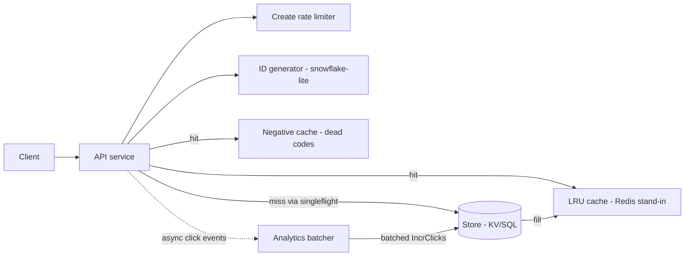

# 01 — URL Shortener

Shorten long URLs to `https://sho.rt/{code}` and redirect fast at read-heavy
scale, with per-code click statistics, optional custom aliases, and optional
TTLs.

## Problem statement

Given an arbitrarily long URL, mint a short, non-guessable-ish code that
redirects to it. The read path (redirect) dominates and must be extremely
cheap; the write path (create) is comparatively rare and can afford
validation, rate limiting, and ID generation. Codes must never collide, and
click counts must be tracked without slowing redirects down.

## Requirements

**Functional**

- Create a short URL from a long URL; optionally under a caller-chosen
  custom alias; optionally with a TTL after which the code stops resolving.
- Redirect `GET /{code}` to the long URL.
- Per-code click stats (`clicks`, `created_at`, `expires_at`).
- Delete a mapping.

**Non-functional**

- Read:write ≈ 100:1; p99 redirect < 10 ms on a cache hit.
- Codes non-guessable-ish (time+shard+sequence IDs, not a counter).
- No collisions ever: generated IDs are unique by construction; custom
  aliases are claimed atomically (conditional put).
- Horizontal scalability: every component is either stateless or maps to a
  shardable/replicated production service (see production mapping).

## Back-of-envelope estimates

| Quantity | Estimate |
|---|---|
| New URLs | 100 M/month ≈ **40 writes/s** |
| Redirects (100:1) | ≈ **4,000 reads/s** |
| Code space | 7 chars of base62 = 62⁷ ≈ **3.5 × 10¹²** — decades of headroom |
| Row size | ~500 B (code, URL, timestamps, counters) |
| Storage growth | 100 M × 500 B ≈ 50 GB/year → **~60 GB/year** with indexes |
| Cache | top 20% of codes serve ~80% of redirects; 10⁴–10⁶ hot entries fit in memory |

## API

| Method/path | Request → response | Errors |
|---|---|---|
| `POST /api/v1/urls` | `{long_url, custom_alias?, ttl_seconds?}` → `201 {code, short_url, long_url, expires_at?}` | `409` alias taken, `422` bad URL/alias/TTL, `429` rate-limited, `400` malformed body |
| `GET /{code}` | → `302 Location: <long_url>`, `Cache-Control: no-store` | `404` unknown/expired |
| `GET /api/v1/urls/{code}/stats` | → `200 {code, long_url, clicks, created_at, expires_at?}` | `404` |
| `DELETE /api/v1/urls/{code}` | → `204` | `404` |
| `GET /api/v1/debug/analytics` | → `200 {dropped, batches, flushed}` | |
| `GET /healthz`, `GET /readyz` | liveness / readiness | |

## Architecture



**Read path** (`GET /{code}`): negative cache → LRU → singleflight → store →
fill cache → `302`. A click event is enqueued asynchronously on success.

**Write path** (`POST /api/v1/urls`): per-IP token bucket → validate URL /
alias / TTL → snowflake-lite ID → base62 encode → conditional `Create`
(custom aliases claim their code the same way, so races lose cleanly with
`409`) → return.

**Clicks**: the redirect handler does a non-blocking channel send; a single
batching worker aggregates events per code and applies them to the store as
one `IncrClicks(code, n)` per code per flush. When the buffer is full,
events are dropped and counted (`GET /api/v1/debug/analytics`) — analytics
are best-effort, redirect latency is not.

## Deep dives

### 301 vs 302

A `301 Moved Permanently` is cached indefinitely by browsers and shared
caches: after the first visit the client never contacts the shortener
again. That is great for origin load, but it means (a) clicks stop being
counted, (b) deleting a mapping or letting its TTL lapse has no effect for
returning visitors, and (c) the destination can never be repointed. This
service returns **`302 Found` plus `Cache-Control: no-store`** so every hit
traverses the service and analytics, TTL, and deletion all keep working.
The trade: every redirect costs one request — which is exactly what the
cache tier is for. If a deployment truly wanted maximum offload for
immutable links, 301 with a short `Cache-Control: max-age` is the middle
ground.

### ID generation and sharding (snowflake-lite)

Codes come from 64-bit IDs laid out as **41 bits of milliseconds since a
custom epoch (2024-01-01) | 8 bits of shard ID | 14 bits of sequence**.
Each API node gets a distinct `SHARD_ID` (0–255) and can mint 16,384
IDs/ms with **zero coordination** — no central counter to contend on and no
collision is possible across nodes. IDs are roughly time-ordered, which
keeps writes append-friendly in range-partitioned stores. The generator is
mutex-protected; sequence exhaustion spins to the next millisecond; a clock
regression ≤ 5 ms is waited out, larger regressions return
`ErrClockBackwards` rather than risk duplicates (fail-closed). Because the
timestamp dominates the high bits, codes are not sequential from an
observer's perspective across shards and milliseconds — "non-guessable-ish"
without a lookup table. 41 bits of milliseconds last ~69 years; encoded
codes are 7–11 base62 chars.

### Cache design: LRU + negative cache + singleflight

- **Positive LRU** (capacity `CACHE_SIZE`, default 10 k): a mutex-guarded
  doubly-linked-list + map generic LRU standing in for Redis. Cached
  records carry their own `ExpiresAt`, so an entry self-invalidates when
  the mapping's TTL passes.
- **Negative cache** (`LRU[string, time.Time]`, 30 s TTL): dead or
  never-existing codes are remembered so a flood of requests for a deleted
  viral link — or a scanner enumerating the code space — is absorbed in
  memory and never reaches the store. `Create` clears the negative entry
  for its code so a new alias is resolvable immediately.
- **Singleflight**: on a cache miss, concurrent resolvers of the same code
  collapse into one store read; followers block on the leader's result.
  This prevents a cache stampede when a hot entry is evicted or first goes
  viral.
- Writes invalidate: `Delete` removes the positive entry, so the cache can
  never serve a deleted mapping.

### TTL expiry

Expiry is enforced twice, mirroring DynamoDB TTL / Redis semantics: **lazily
on read** (an expired record reads as `ErrNotFound` and is reclaimed on the
spot) and by a **background sweeper** (`Memory.Run`, 1-minute interval) so
unread expired rows do not accumulate. An expired record does not block its
code from being re-claimed.

### Analytics batching and load shedding

`Recorder.Record` is a non-blocking send into a 4,096-event buffer; the
worker flushes when 256 events accumulate **or** every second, whichever
comes first, aggregating counts per code so one flush is one store call per
distinct code. On shutdown the worker drains whatever is buffered and
flushes a final batch. Overflow policy is drop-and-count: `dropped`,
`batches`, and `flushed` counters are exposed at
`GET /api/v1/debug/analytics` and logged on shutdown.

## Scaling & trade-offs

- **Stateless API tier**: all coordination state (store, cache, limiter)
  sits behind interfaces; N replicas behind a load balancer each carry a
  distinct `SHARD_ID`. In this stdlib-only build the store/cache are
  in-process, so replicas would not share state — the interfaces are the
  seam where shared infra plugs in.
- **Read scaling**: cache-first with negative caching and singleflight
  means store QPS is roughly miss-rate × redirect QPS. Add cache replicas /
  Redis cluster before store replicas.
- **Write scaling**: 40 writes/s is trivial; the design scales to millions
  via shard-local ID generation (no hot counter row) and a key-value store
  partitioned by code (uniform distribution since codes are effectively
  random within a millisecond).
- **Consistency trade**: cached redirects can be stale up to eviction for
  repointed URLs (we only invalidate on delete), and click counts are
  eventually consistent (≤ 1 s + flush latency behind). Both are standard
  and acceptable for this domain.
- **Dropped clicks**: under extreme redirect bursts the recorder sheds load
  rather than backpressuring the hot path; the loss is observable, bounded,
  and preferable to elevated redirect latency.

## Production mapping

| In-memory component | Production equivalent |
|---|---|
| `store.Memory` | DynamoDB (code as partition key, TTL attribute) or Postgres (`urls` table, unique index on code) |
| `cache.LRU` (+ negative cache) | Redis / Memcached cluster with `GET/SET/DEL` + short-TTL tombstones |
| `analytics.Recorder` | Kafka click topic + Flink/consumer job batch-upserting into ClickHouse/BigQuery; counters fed back via bulk `UPDATE` |
| `idgen.Generator` | Dedicated ID service (Twitter Snowflake) or per-node generators with coordinated worker IDs (ZooKeeper/etcd lease) |
| `ratelimit.Limiter` | Redis token bucket (Lua script) shared across API nodes |
| `httpkit` server | LB/API-gateway fronted fleet; **CDN/GeoDNS**: redirects are tiny and latency-sensitive, so serve them from edge PoPs (CDN workers reading a replicated KV) with GeoDNS routing clients to the nearest region; the write path stays centralized |

## Run it

```sh
go run ./cmd/urlshortener
# env: PORT (default 8081), BASE_URL, SHARD_ID (0..255), LOG_LEVEL,
#      CACHE_SIZE, RATE_LIMIT_RPS, RATE_LIMIT_BURST
```

Copy-pasteable session:

```sh
# create
curl -s -X POST localhost:8081/api/v1/urls \
  -d '{"long_url":"https://go.dev/blog/error-handling-and-go"}'
# → {"code":"kXj42Aa0","short_url":"http://localhost:8081/kXj42Aa0","long_url":"..."}

# redirect (302 + Location)
curl -si localhost:8081/kXj42Aa0 | head -3

# stats (clicks flush within ~1s)
sleep 1 && curl -s localhost:8081/api/v1/urls/kXj42Aa0/stats

# custom alias + TTL
curl -s -X POST localhost:8081/api/v1/urls \
  -d '{"long_url":"https://example.com","custom_alias":"my-link","ttl_seconds":3600}'

# analytics pipeline health
curl -s localhost:8081/api/v1/debug/analytics

# delete → subsequent redirect 404s
curl -s -X DELETE -o /dev/null -w '%{http_code}\n' localhost:8081/api/v1/urls/my-link
```

Tests:

```sh
gofmt -l systems/01-url-shortener && go vet ./systems/01-url-shortener/... \
  && go test -race ./systems/01-url-shortener/...
```
